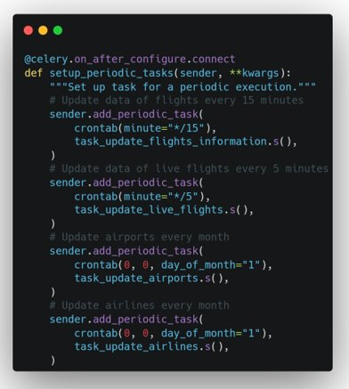

# Flight Tracker via API [Airlabs](https://airlabs.co/docs/)


<br />

- Map to track aircraft in real time 
- `DBMS`: SQLite, PostgreSQL (production) 
- Session-Based authentication (via **flask_login**), Forms validation
- `Deployment`: **Docker**, Nginx, Gunicorn

About docker, we use 9 containers :

	 - ui-ft
	 - mongo (DATABASE)
	 - orion
	 - draco
	 - mysql
	 - worker
	 - scheduler
	 - redis
	 - dashboard
	 
For the stats part we use fiware techno by applying the broker context which is implemented by Orion, it allows us to store the data coming from the API, and to display it.


To get data from API, we use celery, is really useful because i don't want to use my call API in 10 minutes.
<br />


<br />
Function from python (Celery) :
<br />




<br />


<br />


<br />


## ✨ How to use it
*If you want to test our project, you have to get key API from Airlabs* (go to Flight_tracker/apps/configuration/__init__.py#L1)
```bash
$ # Get the code
$ git clone https://github.com/app-generator/flask-soft-ui-dashboard.git
$ cd flask-soft-ui-dashboard
$
$ # Virtualenv modules installation (Unix based systems)
$ virtualenv env
$ source env/bin/activate
$
$ # Virtualenv modules installation (Windows based systems)
$ # virtualenv env
$ # .\env\Scripts\activate
$
$ # Install modules - SQLite Database
$ pip3 install -r requirements.txt
$
$ # OR with PostgreSQL connector
$ # pip install -r requirements-pgsql.txt
$
$ # Set the FLASK_APP environment variable
$ (Unix/Mac) export FLASK_APP=run.py
$ (Windows) set FLASK_APP=run.py
$ (Powershell) $env:FLASK_APP = ".\run.py"
$
$ # Set up the DEBUG environment
$ # (Unix/Mac) export FLASK_ENV=development
$ # (Windows) set FLASK_ENV=development
$ # (Powershell) $env:FLASK_ENV = "development"
$
$ # Start the application (development mode)
$ # --host=0.0.0.0 - expose the app on all network interfaces (default 127.0.0.1)
$ # --port=5000    - specify the app port (default 5000)  
$ flask run --host=0.0.0.0 --port=5000
$
$ # Access the dashboard in browser: http://127.0.0.1:5000/
```

> Note: To use the app, please access the registration page and create a new user. After authentication, the app will unlock the private pages.

<br />

## ✨ Code-base structure

The project is coded using blueprints, app factory pattern, dual configuration profile (development and production) and an intuitive structure presented bellow:

```bash
< PROJECT ROOT >
   |
   |-- apps/
   |    |
   |    |-- home/                          # A simple app that serve HTML files
   |    |    |-- routes.py                 # Define app routes
   |    |
   |    |-- authentication/                # Handles auth routes (login and register)
   |    |    |-- routes.py                 # Define authentication routes  
   |    |    |-- models.py                 # Defines models  
   |    |    |-- forms.py                  # Define auth forms (login and register) 
   |    |
   |    |-- static/
   |    |    |-- <css, JS, images>         # CSS files, Javascripts files
   |    |
   |    |-- templates/                     # Templates used to render pages
   |    |    |-- includes/                 # HTML chunks and components
   |    |    |    |-- navigation.html      # Top menu component
   |    |    |    |-- sidebar.html         # Sidebar component
   |    |    |    |-- footer.html          # App Footer
   |    |    |    |-- scripts.html         # Scripts common to all pages
   |    |    |
   |    |    |-- layouts/                   # Master pages
   |    |    |    |-- base-fullscreen.html  # Used by Authentication pages
   |    |    |    |-- base.html             # Used by common pages
   |    |    |
   |    |    |-- accounts/                  # Authentication pages
   |    |    |    |-- login.html            # Login page
   |    |    |    |-- register.html         # Register page
   |    |    |
   |    |    |-- home/                      # UI Kit Pages
   |    |         |-- index.html            # Index page
   |    |         |-- 404-page.html         # 404 page
   |    |         |-- *.html                # All other pages
   |    |    
   |  config.py                             # Set up the app
   |    __init__.py                         # Initialize the app
   |
   |-- requirements.txt                     # Development modules - SQLite storage
   |-- requirements-mysql.txt               # Production modules  - Mysql DMBS
   |-- requirements-pqsql.txt               # Production modules  - PostgreSql DMBS
   |
   |-- Dockerfile                           # Deployment
   |-- docker-compose.yml                   # Deployment
   |-- gunicorn-cfg.py                      # Deployment   
   |-- nginx                                # Deployment
   |    |-- appseed-app.conf                # Deployment 
   |
   |-- .env                                 # Inject Configuration via Environment
   |-- run.py                               # Start the app - WSGI gateway
   |
   |-- ************************************************************************
```

<br />


